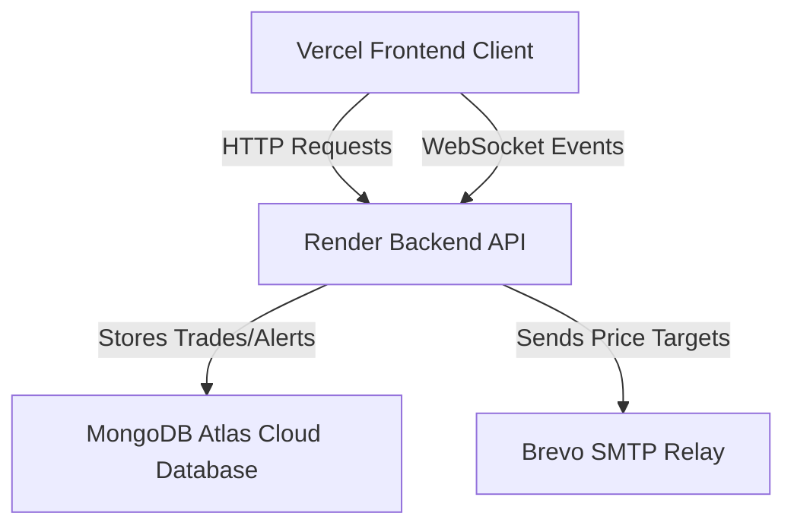

# StockSim — Real-time Simulated Equity Trading Platform

StockSim is a high-fidelity, full-stack simulated stock trading and analysis platform. It provides users with virtual paper trading capabilities, real-time market data updates, live level 2 order depth mockups, interactive charts, and email price-target monitoring. Designed as a state-of-the-art cyberpunk interface with flexible light/dark mode styling, the application operates fully in the cloud using a modern serverless/split-deployment model: **Frontend on Vercel**, **Backend on Render**, and **Database on MongoDB Atlas**.

###  Live Platform Link
Deploy URL: [https://stock-trading-simulator-topaz.vercel.app/](https://stock-trading-simulator-topaz.vercel.app/)

---

##  Architecture & Tech Stack

The system relies on a split-deployment model for optimal performance, stability, and zero-cost HTTPS secure connections:



- **Frontend Client**: React Single Page Application (SPA) bundled via Vite. Deployed and served natively on **Vercel** with client-side SPA routing rewrites.
- **Backend API**: NodeJS Express server deployed on **Render** (Free Tier) with trust proxy enabled, managing socket connections, Cron background job scheduling, and secure user sessions.
- **Database**: Cloud-hosted **MongoDB Atlas** database mapping persistent user trade histories, alerts, and standings.
- **Email Alerts**: Integrated with **Nodemailer** routed through a **Brevo** SMTP relay to trigger user price alerts.

---

##  Root File Structure

```text
├── README.md                   # Core Platform documentation
├── backend/
│   ├── package.json            # Node backend dependencies
│   ├── src/                    # Backend API codebase
│   └── .env                    # System parameters
└── frontend/
    ├── package.json            # Vite frontend dependencies
    ├── src/                    # React UI codebase
    ├── vercel.json             # Vercel SPA routing rules
    └── .env                    # Frontend environment configurations
```

---

##  Local Development Setup

To run the frontend and backend microservices locally:

### 1. Backend Service
1. Navigate to the `backend/` directory.
2. Install dependencies:
   ```bash
   npm install
   ```
3. Copy `.env.example` to `.env` and fill in your MongoDB connection pool, JWT secrets, and API credentials.
4. Launch the local API server:
   ```bash
   npm run dev
   ```
   The API will run on [http://localhost:5000](http://localhost:5000).

### 2. Frontend Client
1. Navigate to the `frontend/` directory.
2. Install dependencies:
   ```bash
   npm install
   ```
3. Copy `.env.example` to `.env` (maps `VITE_API_URL` to your local backend API).
4. Launch the Vite development server:
   ```bash
   npm run dev
   ```
   The client will run on [http://localhost:5173](http://localhost:5173).

---

##  Security & Deployment Hardening Standards
- **Dynamic CORS Checker**: Incorporates a dynamic CORS validation engine supporting standard domains, dynamic localhost development ports, and Vercel preview/production domains dynamically.
- **Dynamic OAuth State Redirection**: Uses secure OAuth `state` parameters to dynamically parse and return users to the exact staging preview or production deployment domain they logged in from.
- **Token Security**: Shifted authentication refresh tokens from vulnerable LocalStorage caches to secure, `HttpOnly`, `SameSite=Strict` cookies.
- **Rate Limiting**: Strictly limits authentication endpoints (login/register) to a maximum of 15 requests per 15 minutes to block brute-force attempts.
- **Input Sanitization**: Implements robust pattern matching and alphanumeric username validation schemas to block XSS and NoSQL injection attempts.
