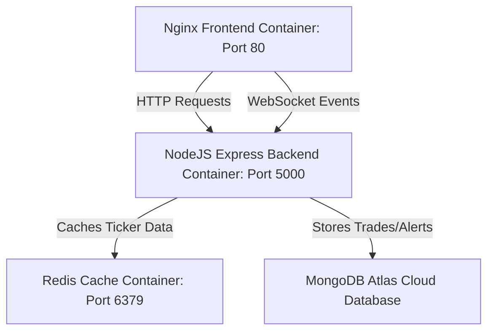

# 📈 StockSim — Real-time Simulated Equity Trading Platform

StockSim is a high-fidelity, full-stack simulated stock trading and analysis platform. It provides users with virtual paper trading capabilities, real-time market data updates, live level 2 order depth mockups, interactive charts, and email price-target monitoring. Designed as a state-of-the-art cyberpunk interface with flexible light/dark mode styling, the application operates fully in the cloud under the AWS Free Tier, relying on containerized microservices managed through Docker Compose and connected to a remote MongoDB Atlas database.

### 🌐 Live Platform Link
Deploy URL: [http://ec2-13-60-157-57.eu-north-1.compute.amazonaws.com](http://ec2-13-60-157-57.eu-north-1.compute.amazonaws.com)

---

## 🛠️ Architecture & Microservices
The system relies on Docker containers to orchestrate multiple frontend and backend services cleanly:



- **Frontend Client**: React Single Page Application (SPA) bundled via Vite. Served in production through an optimized multi-stage **Nginx** container.
- **Backend API**: NodeJS Express server managing socket routing, Cron background job scheduling, and secure user sessions.
- **Caching Layer**: Redis cache instance used to manage ephemeral pricing feeds.
- **Database**: Remote MongoDB Atlas database mapping persistent user trade histories, alerts, and standings.

---

## 📂 Root File Structure

```text
├── docker-compose.yml          # Local & production multi-container orchestrator configuration
├── README.md                   # Core Platform documentation
├── backend/
│   ├── Dockerfile              # Alpine Node environment configuration
│   ├── .dockerignore           # Excludes heavy node_modules & development environments
│   ├── package.json            # Node backend dependencies
│   ├── src/                    # Backend API codebase
│   └── .env                    # System parameters
└── frontend/
    ├── Dockerfile              # Multi-stage build serving React static assets via Nginx
    ├── nginx.conf              # Handles SPA client-side routing
    ├── .dockerignore           # Keeps build contexts lightweight
    ├── package.json            # Vite frontend dependencies
    ├── src/                    # React UI codebase
    └── .env                    # Frontend environment configurations
```

---

## 🚀 Getting Started & Local Orchestration

To run the entire system locally with one command:

### 1. Prerequisites
- Install [Docker Desktop](https://www.docker.com/products/docker-desktop/) on your local machine.

### 2. Launching the App
Run this command from the project root directory:
```bash
docker-compose up --build
```
Once initialized, access:
- **Client App**: [http://localhost](http://localhost)
- **API Server**: [http://localhost:5000/api](http://localhost:5000/api)

---

## 🔒 Security Hardening Standards
- **Token Security**: Shifted authentication refresh tokens from vulnerable LocalStorage caches to secure, `HttpOnly`, `SameSite=Strict` cookies.
- **Rate Limiting**: Strictly limits login and registration endpoints to a maximum of 15 requests per 15 minutes.
- **Input Sanitization**: Implements robust pattern matching and alphanumeric username validation schemas to block XSS and NoSQL injection attempts.